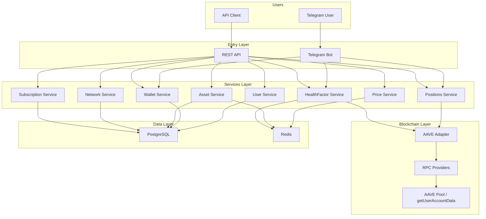

# AAVE Health Factor Bot

A **Telegram bot and backend service** for monitoring **AAVE lending
positions and Health Factor risk** across EVM-compatible blockchain
networks.

The system provides **read-only wallet tracking**, track **Health
Factor** and liquidation risk, monitors **price changes**, and sends **Telegram
notifications** when risk conditions are met.

---

## 📑 Table of Contents

- [Features](#-features)
- [System Architecture](#-system-architecture)
- [Project Structure](#-project-structure)
- [Core Services](#-core-services)
- [Notifications](#-notifications)
- [Internationalization](#-internationalization)
- [Public API](#-public-api)
- [Background Workers](#-background-workers)
- [Storage](#-storage)
- [Security](#-security)
- [Scalability](#-scalability)
- [License](#-license)

---

## 📌 Overview

This project is a **modular layered backend** for monitoring DeFi lending positions in AAVE.

It combines:

- Telegram bot (user interaction)
- REST API (public endpoints)
- Blockchain adapter (AAVE integration)
- Background workers (data updates)
- Redis cache (fast reads)

The system is designed for **continuous monitoring**, not transaction execution.

---

## 🚀 Features

- Monitor **AAVE lending positions**
- Track **Health Factor** and liquidation risk
- Detect **liquidation risk**
- **Multi-network support** (Ethereum, Arbitrum, Avalanche)
- Real-time **token price updates**
- **Price change alerts (\>5%)**
- **Quick asset lookup via ticker input (e.g. BTC, ETH)**
- **Telegram notifications**
- **PostgreSQL** persistent storage
- **Redis** caching layer
- **Background workers**
- **Localization (EN / RU)**
- Public REST API:
  - `/prices`
  - `/assets`
  - `/networks`

---

## 🧠 System Architecture

The architecture is designed for scalability and real-time monitoring of
DeFi positions across multiple networks.

---

## 📦 Project Structure

src
├── api
├── bot
├── services
├── blockchain
└── database

---

## 🧩 Core Services

### Asset Service

- Manage supported assets
- Store metadata
- Handle collateral parameters

### Price Service

- Fetch and normalize prices
- Cache in Redis
- Detect price changes (\>5%)

### Network Service

- Manage blockchain networks
- Store RPC endpoints and chain IDs

### Wallet Service

- Add/remove wallets
- Validate format
- Link to users

### User Service

- Manage users
- Stores user data and preferences

### Positions Service

- Fetch AAVE reserves
- Calculate collateral, debt, borrow capacity

### HealthFactor Service

- Compute Health Factor
- Detect liquidation risk
- Normalize across networks

### Subscription Service

- Manage plans (Free / Pro)
- Wallet & notification limits
- Feature gating

---

## 🔔 Notifications

- Health Factor alerts
- Price change alerts (\>5%)

---

## 🌍 Internationalization

- English
- Russian

Language is auto-detected from Telegram.

---

## 🔌 Public API

### Health

GET /health

### Assets

GET /assets

### Prices

GET /prices

### Networks

GET /networks

---

## ⚙️ Background Workers

- Price Worker
- Assets Worker
- Health Factor Worker

---

## 🗄 Storage

### PostgreSQL

- users
- wallets
- healthfactors
- assets
- prices
- networks

### Redis

- ABI caching
- assets caching
- price caching
- network caching
- user caching
- wallet caching
- fast reads

---

## 🔐 Security

- No private keys stored
- Read-only wallet tracking
- Input validation
- Sensitive data not exposed

---

## 📈 Scalability

- Stateless API
- Horizontal scaling via workers
- Redis caching layer

---

## 📜 License

MIT
